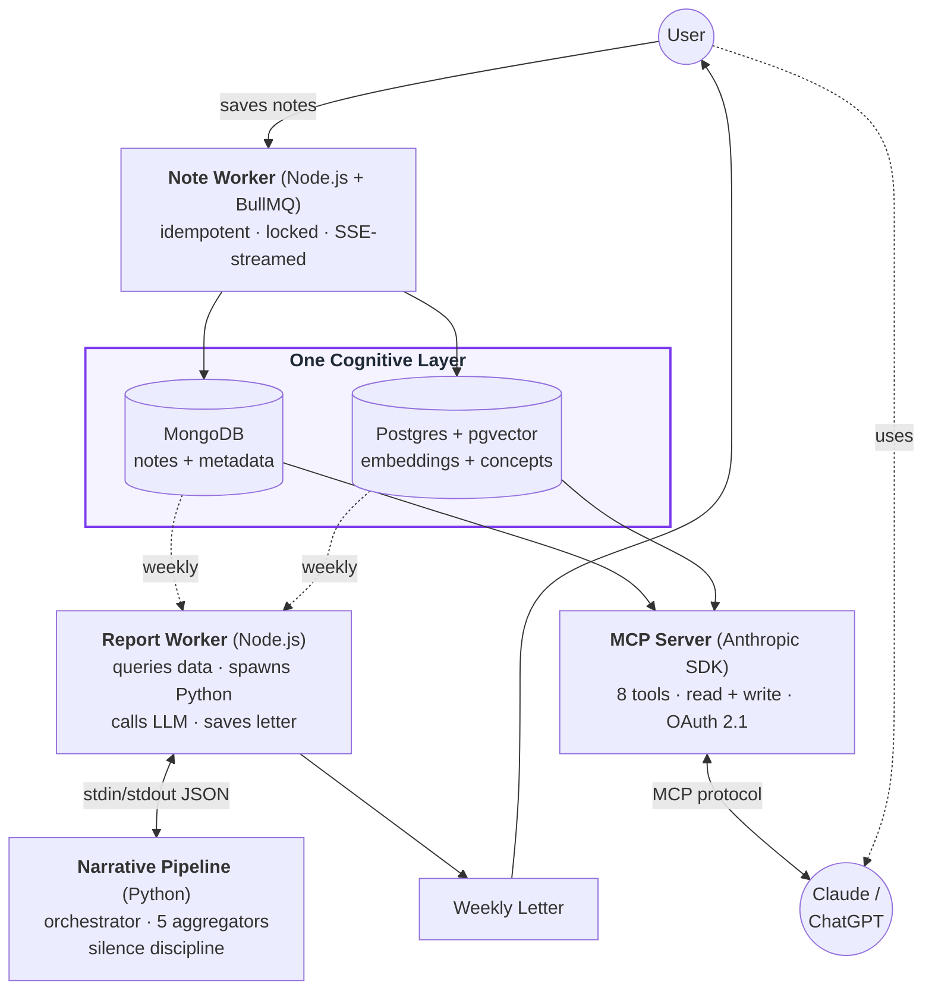

# Hindsight

> A personal reflective system that reads your notes and writes you a weekly letter about patterns in your own writing — and exposes that same structured context to Claude via MCP, so the LLM can engage with you with depth a generic memory feature can't reach.

🔗 **Live:** [hindsight-studio.vercel.app](https://hindsight-studio.vercel.app)

---

## What it does

You save notes — things you wrote, things you preserved from elsewhere. Hindsight processes each note through an LLM pipeline that extracts structured metadata (themes, cognitive units, intent signals) and stores embeddings for semantic retrieval.

Once a week, a Python pipeline aggregates that week's notes and generates a letter-format reflection — observing patterns in your thinking that are hard to see from inside.

An MCP server exposes the same structured context to Claude, so when you talk to it, it can engage with you as someone whose recent themes, written-vs-saved content, and stable concepts it actually knows.

---

## Why this, not Memory

Generic memory features (ChatGPT Memory, Claude's memory) store **facts about users**: "user likes Python", "user lives in Tokyo". That's a useful primitive, but it misses three things that actually shape who a person is:

- **Source provenance.** Did you *write* this thought, or did you *save* a Murakami poem because it moved you? A generic memory layer treats both as "things the user said." Hindsight treats them as opposite signals about you, and propagates that distinction through the entire stack — including the MCP tool responses Claude sees.
- **Temporal trajectory.** Memory is a snapshot ("user is uncertain about career"). Hindsight is a time series ("user's stance on X moved from uncertain to decided over three weeks"). The weekly narrative is built around shifts, not states.
- **Concept-level modelling.** Not "user knows Node.js," but "user uses Node.js for queue-backed streaming workers in their personal project." Concepts are stored as units with context, semantically merged so they accumulate meaning over time instead of fragmenting into duplicates.

The weekly letter and the MCP server are two surfaces onto the same underlying layer.

Platform memory optimises for the next conversation. Hindsight optimises for the user's understanding of themselves — and lives outside any single LLM vendor.

---

## Architecture

Three components share one cognitive layer. New features extend the system by adding queries against that layer, not by adding new tables.

The note pipeline is real-time and per-note. The narrative pipeline is batch and per-week. The MCP server is on-demand and per-conversation. They share the same data substrate but have different access patterns — and getting the substrate right (concept-level storage, semantic similarity over string match, separation of volatile metadata from structured retrieval) is what makes the three-component story work.

---

## Engineering details worth a closer look

### MCP tool descriptions as prompt engineering

The MCP server exposes 8 tools to Claude — 7 read-only, plus `save_memory` for writing new entries — but the interesting work isn't the API surface, it's the descriptions. Each tool's description tells Claude *how to think about the data*, not just what it returns:

> *"sourceType: 'authored' means the user wrote this themselves; 'saved' means the user preserved external content. For 'saved' notes WITHOUT a description, do NOT treat the summary as the user's own thoughts."*

This isn't documentation — it's instruction. The tool descriptions are where Claude learns that source provenance matters, that emotional trajectory should be drawn only from authored notes, that a saved poem isn't a confession. Whether and how Claude uses the context layer correctly depends on this prompt-engineering surface as much as on the data itself.

Writes get the same treatment, with a sharper edge: `save_memory`'s description tells Claude to reuse an existing topic name exactly rather than inventing near-duplicates, to write self-contained content with no reference to "the conversation above," and to only write when the user clearly wants something remembered — not on every mildly interesting exchange. Reads can be over-fetched with little cost; writes accumulate permanently in the user's memory store, so the tool description is the only thing keeping it clean.

### The "why you saved it" design pivot

The first version of Hindsight assumed content would reveal user intent. It didn't. A personal essay and a saved Murakami poem look identical to an LLM — both are evocative prose in first person. The system was reading saved external content as confessional self-writing, and the weekly letters drifted accordingly.

The fix wasn't to make the LLM smarter. **No amount of inference can break a fundamental ambiguity in the input.** The fix was two minimal user inputs: `sourceType` (one click — did you write this or save it?) and an optional one-line description (why is this meaningful to you?). These two fields propagate through the entire pipeline as the highest-priority signals — over LLM inference, over content analysis. Engineering instinct said "make the LLM smarter." Product instinct said "give the user a way to express intent." The second was correct.

### Concept store with semantic merging

Each note generates 1–5 cognitive units — concepts plus the user's relationship to them, like `{concept: "Node.js", context: "used in BullMQ-backed streaming workers"}`. When new units come in, naive string match fails ("Node.js" and "nodejs" diverge), so merging is done by embedding similarity with a 0.92 threshold.

Each merge reinforces the concept's confidence with a convergence formula — `new = old + (1 − old) × 0.3` — so each reinforcement closes 30% of the gap to certainty. Context strings accumulate (bounded at 1000 chars to handle years of input). The result: "Node.js" becomes a single concept with thickening context, instead of fragmenting into a dozen near-duplicates. This is what turns Claude's responses from "you know Node.js" into "you use Node.js for queue-backed automation in your personal project."

---

## Stack & Status

- **Backend:** Node.js · Express · BullMQ · MongoDB · Redis
- **Pipelines:** Python · pandas · Pydantic
- **Vector store:** Postgres + pgvector (Supabase)
- **Frontend:** React · TypeScript · Vite · SSE
- **AI:** OpenAI API · Anthropic MCP SDK
- **Auth:** OAuth 2.1 + PKCE with dynamic client registration for the MCP layer (`mcp:read` / `mcp:write` scopes) · JWT for the app
- **Infra:** Fly.io · Vercel

**Status:** In production. Solo-built. Note pipeline, weekly narrative, MCP server (with OAuth 2.1 authorization and write access), and landing page are all live. Roadmap: broader LLM provider support, and exposing the cognitive layer to a wider tool surface.

---

